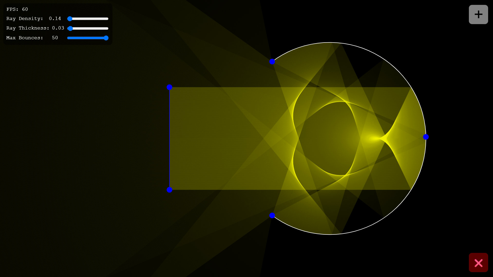

# Optics Simulator

This project is a JavaScript implementation of a ray tracer which is able to interact with plane and curved mirrors. The user can adjust scene settings and add objects including light beams, light rays, mirrors etc.

---

## Live Demo

[**Click here to open the live webpage**](https://compro72.github.io/Optics-Simulator/)

---

## Features

- **Interactive Objects:** All objects have draggable points for positioning.
- **Sources of Light:** Sources of light include a ray, beam and a point source.
- **Types of Mirrors:** The types of mirrors available is the plane mirror and the curved mirror.
- **Object Creation Menu:** Any of the objects can be created using the + menu.
- **Object Deletion Button:** Any of the objects can be deleted from the scene using the X button.
- **Scene Settings:** The global properties ray density, ray thickness and maximum ray bounces can be changed using sliders.

---

## Technical Description

The main architecture for managing the scene is an object oriented hierarchy system. The high level container class Scene, manages the light and mirror arrays containing all the scene objects. The objects include the class instances of PlaneMirror, CurvedMirror, Ray, Beam and PointSource. Beam and PointSource instances hold their own array of Ray instances. An update call, a render call and a renderUi call is passed through this hierarchy. For all the objects, the update call updates their drag points considering the user input. For exclusively light source objects, the mirrors array is passed into the update call for the rays to calculate their light path. Each ray can calculate its path by first finding the closest mirror intersection, then using snell's law and vector math to reflect on the mirror's normal vector. This is repeated until the maximum bounce limit is reached or there are no intersections remaining. For the render call, a single yellow stroke is used to render all the light paths and another stroke is used to render all the white mirrors. For the renderUi call, a blue stroke and fill is used to render all the draggable points. By reducing the amount of stroke calls, the rendering becomes more performant.

---

## Future Improvements

* **Added Features:** More objects could be added like a parabolic mirror or a floodlight. This would be easy to do because of this project's modular design.
* **GPU Acceleration:** Moving rendering and ray tracing to WebGPU or WebGL shaders will improve performance and will allow more rays.
* **UI Features:** Global properties like ray density and ray thickness could be displayed as the selected object's local properties. This would allow the user more freedom.
---

## How to Run Locally
1. Clone this repository or download the code.
2. Open `index.html` in any web browser.
